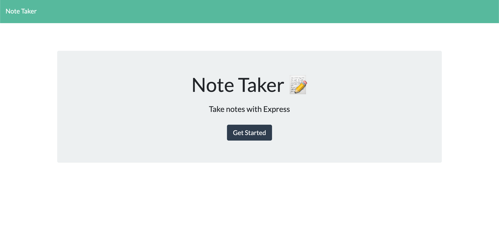
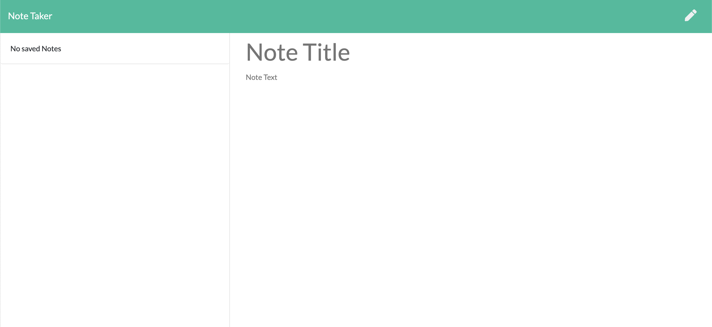
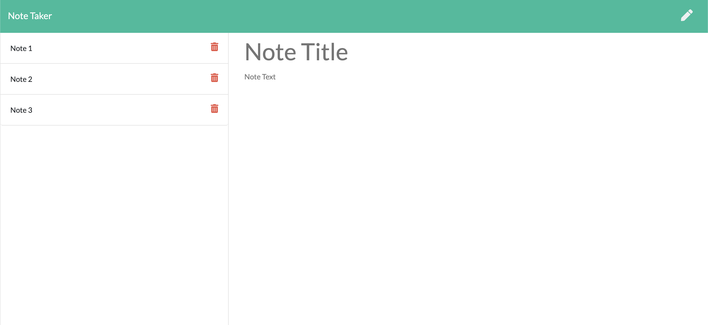
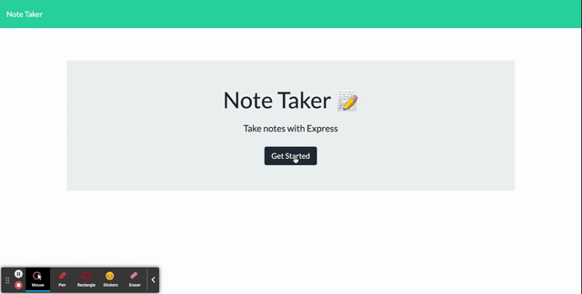

# Note Taker
An app that can be used to write, save, and delete notes. This is the homework for Note Taker node-express.js

You can clone this repo.

git clone https://github.com/chergul/Note-Taker.git

## Description
​
EXPRESS Note Taker is intended to be used for anyone who needs a place to organize their tasks and thoughts.
​
## Deployed app link
(https://sleepy-fortress-05923.herokuapp.com/notes)
​
## Screenshot for the application
​
1-Home Page

2-Note Page

3-Notes

​
## Video for the app
​

## Questions
If you have any questions about this repo, you can open an issue, or contact directly at 
ceyda_hergul@hotmail.com
​

